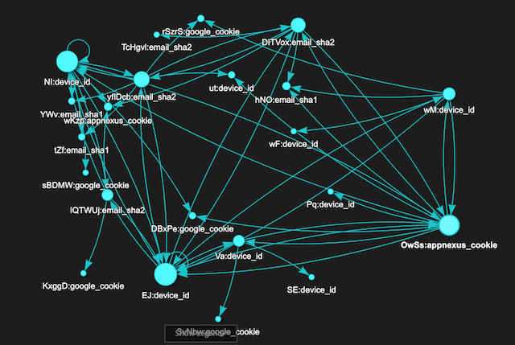

# spark-dsegf-identity-resolution
Identity Resolution using Spark 3.1 and DSE GraphFrames (DSE v6.8) with BYOS

## What is Identity Resolution
- Identity resolution (IDR) is the process of matching identifiers across devices and touchpoints to a single profile which helps build a cohesive, omnichannel view of a consumer, enabling brands to deliver relevant messaging throughout the customer journey
- The underlying data source for IDR is generally an Identity Graph (IDG) which is a profile database housing all known identifiers correlated to individuals. The IDG also stores the metadata about the identifiers
- An IDG as below for a single user who is represented **_via multiple identifiers all connected to each other directly or transitively_**


## Whats in this demo
Below steps using Apache Spark 3.1 with DSE 6.8 via [BYOS support (Bring your own spark)](https://docs.datastax.com/en/dse/6.8/dse-dev/datastax_enterprise/spark/byosIntro.html)
- Populating the IDG using JSON identifier data sets (**id-graph-loader**)
- Computing the count of identifiers that are connected to a set of input identifiers via IDG (**id-graph-resolver**)
- Exporting the matched identifiers that are connected to a set of input identifiers via IDG (**id-graph-resolver**)

## IDG V & E data generation
- Data can be generated using [this google sheet](https://docs.google.com/spreadsheets/d/1fTw1-8X0P1dQDO7IsrhgnATMFsGWbmEiHATaB6lZfqI/edit?usp=sharing)
- To generate json from the google sheet use this [link](https://csvjson.com/csv2json) 

## How to run
- **id-graph-loader**
  - Build: 
    ```
    cd id-graph-loader
    ./gradlew build shadowJar
    ```
  - Generate the [byos.properties](https://docs.datastax.com/en/dse/6.8/dse-dev/datastax_enterprise/spark/byosGeneratingConfigFile.html)
  - Run:
  ```
  cd spark-3.1.2-bin-hadoop3.2/
  bin/spark-submit --properties-file ~/dse-6.8.18/byos.properties --class com.datastax.examples.dsegf.Loader id-graph-loader-1.0-SNAPSHOT-all.jar <vertexJsonPath> <edgeJsonPath>
  ```

- **id-graph-resolver**
  - Build:
  ```
    cd id-graph-resolver
    ./gradlew build 
    ```
  - Run:
  ```
  cd spark-3.1.2-bin-hadoop3.2/
  bin/spark-submit --properties-file /Users/saurabh.verma/Downloads/dse-6.8.18/byos.properties --class com.datastax.examples.dsegf.IDGResolver id-graph-resolver-1.0-SNAPSHOT-all.jar <toBeMatchedIDsPath.csv> <resolvedIDsOutputPath.csv>
  ```
## Sample Data
- The sample data for loading and resolution are located inside the `resources` folder of the loader and resolver modules

## References
- IDR - https://info.truaudience.com/what-is-identity-resolution#:~:text=Identity%20resolution%20%E2%80%94%20the%20process%20of,messaging%20throughout%20the%20customer%20journey.
